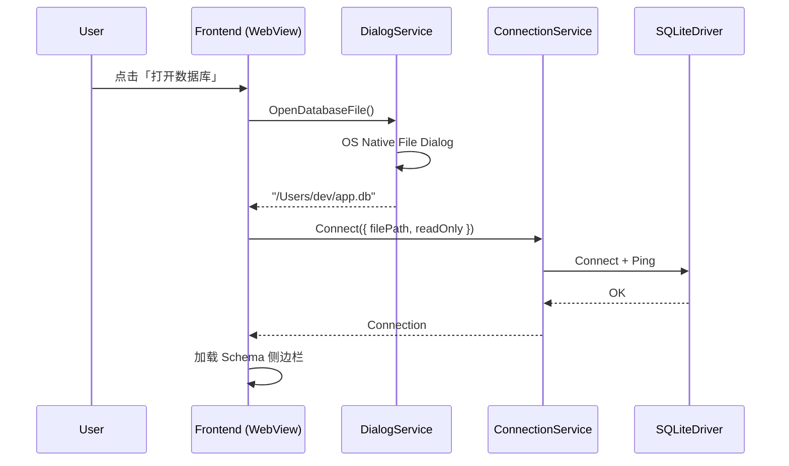
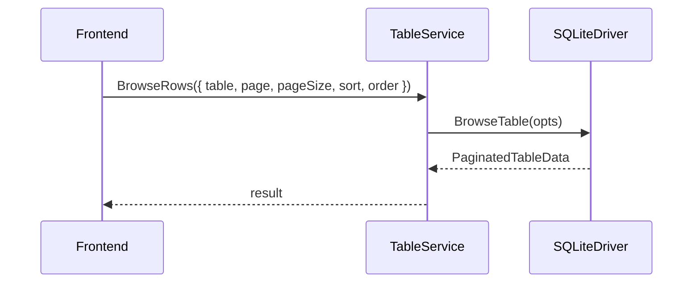

# Data Nexus — 技术设计文档

> 版本: v0.2 · 状态: 草案 · 最后更新: 2026-06-07

## 1. 设计目标

1. **MVP 极简**: 单 SQLite 连接，功能闭环可交付
2. **扩展优先**: 连接管理、Driver 层、Schema 抽象从第一天分离
3. **桌面原生**: Wails 单二进制桌面应用，系统 WebView 渲染，无浏览器 Tab
4. **开发者友好**: Go Service 绑定 + 自动生成 TypeScript 类型，业务层可独立测试

---

## 2. 系统架构

```
┌─────────────────────────────────────────────────────────────────┐
│                    Wails Desktop Window                         │
│  ┌───────────────────────────────────────────────────────────┐  │
│  │  Frontend (OS WebView)                                    │  │
│  │  React + TypeScript + TanStack Query + Zustand            │  │
│  │  调用 wailsjs/go/services/* 生成的绑定                     │  │
│  └───────────────────────────┬───────────────────────────────┘  │
│                              │ In-memory Bridge (<1ms)          │
│  ┌───────────────────────────▼───────────────────────────────┐  │
│  │  Wails Services（绑定层）                                  │  │
│  │  ConnectionService · SchemaService · TableService         │  │
│  │  QueryService · DialogService · AppService                │  │
│  └───────────────────────────┬───────────────────────────────┘  │
│                              │                                  │
│  ┌───────────────────────────▼───────────────────────────────┐  │
│  │  Business Layer（与 UI 无关，可单测）                       │  │
│  │  ConnectionManager · QueryService                         │  │
│  └───────────────────────────┬───────────────────────────────┘  │
│                              │                                  │
│  ┌───────────────────────────▼───────────────────────────────┐  │
│  │  Driver Interface                                         │  │
│  │  └── SQLiteDriver (MVP)                                     │  │
│  └───────────────────────────┬───────────────────────────────┘  │
└──────────────────────────────┼──────────────────────────────────┘
                               │
                    ┌──────────▼──────────┐
                    │   SQLite File (.db) │
                    └─────────────────────┘
```

### 2.1 为何选用 Wails

| 维度 | 原方案（HTTP + embed） | Wails 桌面端 |
|------|------------------------|--------------|
| 交付形态 | 二进制 + 用户手动开浏览器 | 原生窗口，双击即用 |
| 前后端通信 | HTTP/JSON localhost | 内存 Bridge，无端口 |
| 文件选择 | 手动输入路径 | **系统原生文件对话框** |
| 体积/内存 | ~小 | ~15MB 级，OS WebView（非 Electron） |
| 双击 `.db` 打开 | 需自行实现 | Wails 文件关联 + CLI 参数 |
| 与竞品对齐 | 接近 Tabulita/sqlite-web | 接近 TablePlus/Beekeeper 桌面体验 |

选用 **[Wails v2](https://wails.io/)**（稳定版）作为桌面壳；v3 仍为 Alpha，MVP 优先稳定性，后续可评估迁移。

### 2.2 部署与运行模式（MVP）

**唯一交付形态：桌面应用**

```bash
# 开发
wails dev

# 构建
wails build
# 产物: build/bin/data-nexus(.exe / .app)

# 启动时预连接（可选）
./data-nexus --db /path/to/app.db

# 双击 .db 文件关联打开（v0.2 配置安装器）
./data-nexus /path/to/app.db
```

**不再**默认启动 `127.0.0.1:8080` HTTP 服务。前端运行在 WebView 内，通过 Wails 绑定调用 Go。

### 2.3 可选扩展：Headless 模式（v1.x，非 MVP）

保留 `internal/service` 与 `internal/driver` 与 UI 解耦，未来可通过 `--server` 启动 REST API（供 CI/脚本），与桌面模式共享业务层。MVP 不实现。

---

## 3. 技术选型

### 3.1 桌面壳

| 组件 | 选型 | 理由 |
|------|------|------|
| 桌面框架 | [Wails v2](https://wails.io/) | Go 原生、单二进制、系统 WebView、React 模板成熟 |
| 窗口/菜单 | Wails `runtime` + `menu` | 原生菜单栏、文件对话框、剪贴板 |
| 构建 | `wails build` | 跨平台打包 darwin/windows/linux |

### 3.2 后端（Go）

| 组件 | 选型 | 理由 |
|------|------|------|
| 语言 | Go 1.22+ | 与 Wails 同栈，单二进制 |
| UI 边界 | Wails Service 绑定 | 替代 chi HTTP；类型安全、低延迟 |
| SQLite 驱动 | [modernc.org/sqlite](https://pkg.go.dev/modernc.org/sqlite) | 纯 Go，无 CGO，Wails 交叉编译友好 |
| 配置 | CLI flags + 用户目录配置 | `~/.data-nexus/`（v0.2 起） |
| 日志 | `log/slog` | 标准库结构化日志 |

> **移除 MVP 依赖：** chi、embed 静态 HTTP、CORS 中间件。

### 3.3 前端

| 组件 | 选型 | 理由 |
|------|------|------|
| 框架 | React 18 | Wails 官方 React-TS 模板 |
| 语言 | TypeScript 5.x | Wails 自动生成 `wailsjs/` 绑定类型 |
| 构建 | Vite 5 | Wails 模板默认 |
| 后端调用 | `wailsjs/go/services/*` | 替代 fetch/axios |
| 状态 | Zustand + TanStack Query | Query 包装 Service 调用 |
| UI 组件 | shadcn/ui + Tailwind CSS | 可定制、现代风格 |
| SQL 编辑器 | Monaco Editor | VS Code 同款体验 |
| 表格 | TanStack Table | 虚拟滚动、排序、分页 |

### 3.4 开发工具链

| 工具 | 用途 |
|------|------|
| Wails CLI | `wails dev` / `wails build` / 绑定生成 |
| `Taskfile.yml` 或 `Makefile` | 补充 test、lint |
| ESLint + Prettier | 前端规范 |
| golangci-lint | Go 静态检查 |

---

## 4. 项目结构

```
data-nexus/
├── main.go                      # Wails 入口：创建 App、绑定 Services
├── app.go                       # App 生命周期、菜单、窗口配置
├── wails.json                   # Wails 项目配置
├── build/                       # 图标、manifest、darwin/windows 打包资源
│   ├── appicon.png
│   ├── darwin/
│   └── windows/
├── internal/
│   ├── wails/                   # Wails 绑定层（薄封装）
│   │   ├── connection.go        # ConnectionService
│   │   ├── schema.go            # SchemaService
│   │   ├── table.go             # TableService
│   │   ├── query.go             # QueryService
│   │   ├── dialog.go            # DialogService（原生对话框）
│   │   └── app.go               # AppService（版本、主题同步）
│   ├── service/                 # 业务逻辑（UI 无关）
│   │   ├── connection_manager.go
│   │   └── query_service.go
│   ├── driver/
│   │   ├── driver.go
│   │   └── sqlite/
│   ├── model/
│   │   ├── connection.go
│   │   ├── schema.go
│   │   ├── query.go
│   │   └── errors.go            # AppError 结构化错误
│   └── config/
│       └── config.go
├── frontend/                    # Wails 前端（原 web/）
│   ├── src/
│   │   ├── app/
│   │   ├── components/
│   │   ├── features/
│   │   ├── hooks/
│   │   ├── lib/
│   │   │   └── api/             # 封装 wailsjs 调用 + 错误映射
│   │   └── stores/
│   ├── wailsjs/                 # wails generate 自动生成（勿手改）
│   ├── index.html
│   ├── vite.config.ts
│   ├── tailwind.config.ts
│   └── package.json
├── docs/
├── go.mod
└── README.md
```

---

## 5. Wails Services 设计

绑定层只做参数校验、错误转换、调用 `internal/service`，不含 SQL 逻辑。

### 5.1 Service 清单

| Service | 职责 |
|---------|------|
| `ConnectionService` | Connect / Disconnect / GetStatus |
| `SchemaService` | ListTables / GetTableSchema |
| `TableService` | BrowseTableRows |
| `QueryService` | ExecuteSQL |
| `DialogService` | OpenDatabaseFile / SaveFile / ShowMessage |
| `AppService` | GetVersion / GetPlatform |

方法签名与错误码见 [API.md](./API.md)（已改为 Service 绑定契约）。

### 5.2 绑定示例

```go
// internal/wails/connection.go
type ConnectionService struct {
    mgr *service.ConnectionManager
}

func NewConnectionService(mgr *service.ConnectionManager) *ConnectionService {
    return &ConnectionService{mgr: mgr}
}

func (s *ConnectionService) Connect(req model.ConnectRequest) (*model.Connection, error) {
    return s.mgr.Connect(context.Background(), req)
}

func (s *ConnectionService) Disconnect() error {
    return s.mgr.Disconnect(context.Background())
}

func (s *ConnectionService) GetStatus() (*model.ConnectionStatus, error) {
    return s.mgr.Status(), nil
}
```

```typescript
// frontend/src/lib/api/connection.ts
import { Connect, Disconnect, GetStatus } from '../../../wailsjs/go/wails/ConnectionService'

export async function connect(req: ConnectRequest) {
  try {
    return await Connect(req)
  } catch (e) {
    throw mapWailsError(e) // Go error → AppError
  }
}
```

### 5.3 main.go 注册

```go
func main() {
    mgr := service.NewConnectionManager()
    connSvc := wails.NewConnectionService(mgr)
    schemaSvc := wails.NewSchemaService(mgr)
    // ...

    err := wails.Run(&options.App{
        Title:  "Data Nexus",
        Width:  1280,
        Height: 800,
        AssetServer: &assetserver.Options{
            Assets: assets,
        },
        Bind: []interface{}{
            connSvc, schemaSvc, tableSvc, querySvc, dialogSvc, appSvc,
        },
        OnStartup: app.startup,
    })
}
```

### 5.4 ConnectionManager

（与 v0.1 设计相同，不变）

```go
type ConnectionManager struct {
    mu     sync.RWMutex
    active *Connection
    driver driver.Driver
}
```

### 5.5 Driver 接口

（与 v0.1 设计相同，见 [DATA_MODEL.md](./DATA_MODEL.md)）

### 5.6 原生能力（DialogService）

MVP 利用 Wails 桌面特性：

```go
// DialogService.OpenDatabaseFile 打开 .db/.sqlite/.sqlite3 文件选择器
func (s *DialogService) OpenDatabaseFile() (string, error) {
    return runtime.OpenFileDialog(s.ctx, runtime.OpenDialogOptions{
        Title: "选择 SQLite 数据库",
        Filters: []runtime.FileFilter{
            {DisplayName: "SQLite Database", Pattern: "*.db;*.sqlite;*.sqlite3"},
        },
    })
}
```

| 能力 | Wails API | MVP |
|------|-----------|-----|
| 打开数据库文件 | `runtime.OpenFileDialog` | P0 |
| 导出 CSV 路径 | `runtime.SaveFileDialog` | v0.2 |
| 应用菜单 File→Open | `menu` | P0 |
| 拖拽 `.db` 到窗口 | `OnFileDrop` | P1 |
| 文件关联双击打开 | 启动参数 + 安装器 | v0.2 |
| 系统托盘 | `systray` | P2 |

### 5.7 安全考量

| 风险 | MVP 策略 |
|------|----------|
| SQL 注入（BrowseTable） | 表名/列名白名单校验 |
| 任意文件读取 | 路径仅来自用户对话框或显式 CLI 参数 |
| 前端越权调用 | Wails 仅暴露已 Bind 的 Service 方法 |
| 写操作误删 | 前端确认 + 只读连接模式 |
| 结果集过大 | `MaxRows = 10000` 硬限制 |

> 桌面模式下无 CSRF/HTTP 端口暴露问题。

---

## 6. 前后端交互流程

### 6.1 连接流程（原生文件对话框）



### 6.2 表数据浏览



---

## 7. 错误处理策略

Go Service 返回 `error` 时，Wails 将其抛到前端 Promise。统一使用 `*model.AppError`：

```go
type AppError struct {
    Code    string         `json:"code"`
    Message string         `json:"message"`
    Details map[string]any `json:"details,omitempty"`
}

func (e *AppError) Error() string { return e.Message }
```

前端 `mapWailsError` 解析后展示 Toast / inline error。错误码表见 [API.md](./API.md)。

---

## 8. 性能设计

| 场景 | 策略 |
|------|------|
| Bridge 调用 | 内存直调，无 HTTP 序列化开销 |
| 大表 COUNT | `SELECT COUNT(*)`，异步 loading |
| 分页 | `LIMIT/OFFSET` |
| 结果集 | 行数上限 + 流式读取 |
| 前端表格 | TanStack Virtual（>200 行） |
| SQLite 连接池 | `SetMaxOpenConns(1)` |
| 冷启动 | Wails + 纯 Go SQLite，目标 < 1s 窗口可见 |

---

## 9. 测试策略

| 层级 | 范围 | 工具 |
|------|------|------|
| 单元测试 | Driver、ConnectionManager、SQL 构建 | Go `testing` |
| 集成测试 | Service 层（不启动 Wails UI） | Go `testing` + 临时 `.db` |
| 绑定层 | 参数校验、错误映射 | Go `testing` |
| 前端组件 | 连接、表格、SQL 编辑器 | Vitest + Testing Library |
| E2E（P1） | 完整桌面流程 | 手动 / 可选 Playwright+WebView |

> Wails 窗口 E2E 成本高，MVP 以 Service 层集成测试 + 手动清单为主。

---

## 10. 构建与发布

```bash
# 依赖
go install github.com/wailsapp/wails/v2/cmd/wails@latest

# 开发（热重载 Go + 前端）
wails dev

# 生产构建
wails build              # 当前平台
wails build -platform darwin/arm64
wails build -platform windows/amd64
wails build -platform linux/amd64
```

产物位于 `build/bin/`，平台原生格式（macOS `.app`、Windows `.exe`、Linux binary）。

---

## 11. 多数据库扩展路径

（与 v0.1 相同：Driver 接口 + ConnectionManager，MVP 仅 SQLite）

扩展步骤不变；远程数据库（PostgreSQL/MySQL）在桌面模式下通过连接表单输入 host/port，无需 HTTP sidecar。

---

## 12. 架构决策记录

| 决策 | 选择 | 理由 |
|------|------|------|
| 桌面 vs 浏览器 | Wails 桌面 | 用户明确要求；原生文件对话框；更好对标 TablePlus |
| Wails v2 vs v3 | v2 稳定版 | v3 仍 Alpha；v2 模板与文档成熟 |
| HTTP REST | MVP 移除 | Bridge 足够；业务层保留便于未来 headless |
| 前端目录 | `frontend/` | Wails 惯例，非 `web/` |
| Electron | 不采用 | 体积与内存劣势；Go 栈统一 |
