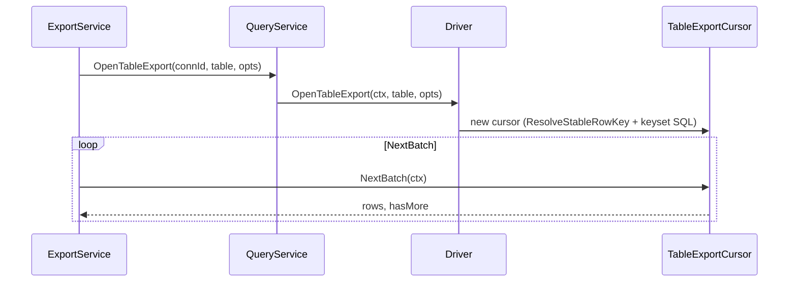

# 整表 CSV 导出 — 多方言差异设计

> **状态:** Phase 1–3（SQLite / PostgreSQL / MySQL PK keyset 导出）已实现。  
> **相关:** [DATA_MODEL.md §7](./DATA_MODEL.md#7-多数据库差异矩阵设计参考) · [API.md §11](./API.md#11-exportservicev02)

---

## 1. 设计原则

- **上层方言无关：** [`ExportTableToFile`](../../internal/service/export_service.go) 只消费 `TableExportCursor`，不感知 SQL 方言。
- **下层方言负责：** 稳定键解析、quoted identifier、keyset SQL、类型序列化、只读事务策略。
- **Browse ≠ Export：** UI 分页可无序；整表导出**必须**有确定性全序，二者不共用 `BrowseTable` 路径。



---

## 2. 稳定排序键策略

| 优先级 | 来源 | SQLite | PostgreSQL | MySQL |
|--------|------|--------|------------|-------|
| 1 | PRIMARY KEY（复合键按 catalog 列序） | ✓ | ✓ | ✓ |
| 2 | UNIQUE NOT NULL 索引 | Phase 2 可选 | Phase 2 可选 | Phase 2 可选 |
| 3 | 隐式 fallback | `rowid` | **无** → 报错 | **无** → 报错 |
| 4 | WITHOUT ROWID 且无 1/2 | `EXPORT_NO_STABLE_KEY` | N/A | N/A |

**产品策略：** MySQL/PG **禁止**猜测顺序；SQLite 允许 `rowid` 作为实现细节。SQLite `WITHOUT ROWID` 表若无 PK 则拒绝导出（SQLite DDL 通常要求 PK，但解析层仍显式检测）。

实现：[`internal/driver/export/resolve_key.go`](../../internal/driver/export/resolve_key.go)

---

## 3. 分页策略

| 方言 | 方式 | 说明 |
|------|------|------|
| 全部 | **Keyset（seek）** | 禁止大表 `OFFSET`；复合键用确定性全序 |
| SQLite | row value `(a,b) > (?,?)` | 3.15+，与 `modernc.org/sqlite` 兼容 |
| PostgreSQL | row value `(a,b) > ($1,$2)` + schema 限定 | `"public"."users"` |
| MySQL | lexicographic OR keyset | `` (`k1` > ?) OR (`k1` = ? AND `k2` > ?) ``；兼容 5.7+ |

默认 batch size：**1000** 行。

---

## 4. 表引用与标识符

| 方言 | 表引用 | 列引用 |
|------|--------|--------|
| SQLite | `"table"` | `"column"` |
| PostgreSQL | `"schema"."table"` | `"column"` |
| MySQL | `` `table` `` / `` `db`.`table` `` | `` `column` `` |

各 driver 复用已有 `QuoteIdentifier`；Export cursor 不硬编码引号。

---

## 5. 类型 → CSV 序列化

| 类型 | SQLite | PostgreSQL | MySQL |
|------|--------|------------|-------|
| BLOB/BYTEA | `[BLOB N bytes]` | 同左或 hex（待定） | 同左 |
| JSON/JSONB | 文本 | 文本 | 文本 |
| BOOLEAN | 0/1 或 true/false | true/false | 0/1 |
| TIMESTAMP/TZ | ISO8601 字符串 | ISO8601 + 时区 | `YYYY-MM-DD HH:MM:SS` |
| NULL | 空字段 | 空字段 | 空字段 |

**策略：** 复用各方言 `SerializeCellValue`；CSV 格式选项（`CSVFormatOptions`）三方一致。

---

## 6. 事务与一致性

| 方言 | 长导出读一致性 |
|------|----------------|
| SQLite | 默认 snapshot；只读连接 `?mode=ro` |
| PostgreSQL | `BEGIN READ ONLY` 或 `SET TRANSACTION READ ONLY` |
| MySQL | InnoDB consistent read（默认 REPEATABLE READ 单连接） |

导出期间不阻塞写操作；文档说明「导出为快照时点数据，非实时同步」。

---

## 7. 进度与取消（方言无关）

- 打开游标时**不**执行 `COUNT(*)`，避免大表全表计数耗时；进度仅展示已导出行数。
- `context.Cancel` → `EXPORT_CANCELLED` → 删除半成品文件。
- Wails `export:progress` 事件 payload：`{ exportId, exported }`。

---

## 8. 错误码

| Code | 场景 |
|------|------|
| `EXPORT_NO_STABLE_KEY` | 无法确定稳定排序键 |
| `EXPORT_CANCELLED` | 用户取消 |
| `TABLE_NOT_FOUND` | 表/视图不存在 |
| `SQL_ERROR` | 方言 SQL 失败 |

前端统一文案，不暴露方言细节。

---

## 9. 与 SQL 查询结果导出的边界

| 能力 | 整表导出 | SQL 结果导出 |
|------|----------|--------------|
| 入口 | DataGrid「导出全表」 | SQL Tab「导出 CSV」 |
| 后端 | `OpenTableExport` → 流式写盘 | 前端 `rowsToCSV` + `WriteTextFile` |
| 行数限制 | **无硬上限** | `MaxQueryRows`（10,000） |
| 稳定键 | 必须 | 依赖用户 SQL 的 ORDER BY |

---

## 10. 实施阶段

| Phase | 范围 | 状态 |
|-------|------|------|
| Phase 1 | SQLite `TableExportCursor` + keyset | 已实现 |
| Phase 2 | PostgreSQL `OpenTableExport` | 已实现 |
| Phase 3 | MySQL `OpenTableExport` | 已实现 |

**Driver 接口：**

```go
OpenTableExport(ctx context.Context, tableName string, opts model.TableExportOptions) (export.TableExportCursor, error)
```

**游标接口：**

```go
type TableExportCursor interface {
    Columns() []model.ColumnMeta
    NextBatch(ctx context.Context) (*model.TableExportBatch, error)
    Close() error
}
```
