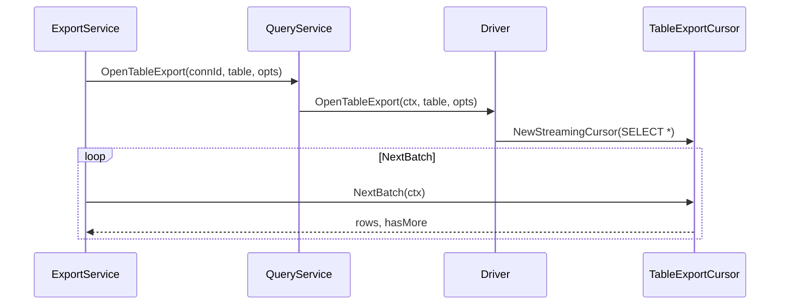

# 整表 CSV 导出 — 多方言差异设计

> **状态:** v0.4.0 — SQLite / PostgreSQL / MySQL **统一流式单查询**导出已实现。  
> **相关:** [DATA_MODEL.md §7](./DATA_MODEL.md#7-多数据库差异矩阵设计参考) · [API.md §11](./API.md#11-exportservicev02)

---

## 1. 设计原则

- **上层方言无关：** [`ExportTableToFile`](../../internal/service/export_service.go) 只消费 `TableExportCursor`，不感知 SQL 方言。
- **下层方言负责：** quoted identifier、`SELECT *` 流式扫描、类型序列化、只读事务策略（PG）。
- **Browse ≠ Export：** UI 分页可无序；整表导出走独立 `OpenTableExport` 路径，**不保证行序**（快照内行集合完整）。



---

## 2. 扫描策略（v0.4+）

| 方言 | SQL | 行序 | 无 PK 表 |
|------|-----|------|----------|
| SQLite | `SELECT * FROM "table"` | 不保证 | 允许 |
| PostgreSQL | `SELECT * FROM "schema"."table"` | 不保证 | 允许 |
| MySQL | ``SELECT * FROM `table` `` | 不保证 | 允许 |

实现：[`internal/driver/export/streaming_cursor.go`](../../internal/driver/export/streaming_cursor.go)

[`resolve_key.go`](../../internal/driver/export/resolve_key.go) 保留供将来 keyset/UPSERT 等场景；**整表导出不使用**。

---

## 3. 分批读取

| 项 | 说明 |
|----|------|
| 方式 | 单次 `QueryContext`，`NextBatch` 从 `sql.Rows` 读最多 `batchSize` 行 |
| 默认 batch | **1000** 行 |
| 内存 | 仅当前 batch 驻留内存 |
| 终止 | EOF 或 `context` 取消 → `EXPORT_CANCELLED` |

~~Keyset（seek）分页~~ 已于 v0.4.0 移除。

---

## 4. 表引用与标识符

| 方言 | 表引用 | 列引用 |
|------|--------|--------|
| SQLite | `"table"` | `"column"` |
| PostgreSQL | `"schema"."table"` | `"column"` |
| MySQL | `` `table` `` / `` `db`.`table` `` | `` `column` `` |

各 driver 复用已有 `QuoteIdentifier`；Export cursor 不硬编码引号。

---

## 5. 类型 → CSV 序列化

| 类型 | SQLite | PostgreSQL | MySQL |
|------|--------|------------|-------|
| BLOB/BYTEA | `[BLOB N bytes]` | 同左或 hex（待定） | 同左 |
| JSON/JSONB | 文本 | 文本 | 文本 |
| BOOLEAN | 0/1 或 true/false | true/false | 0/1 |
| TIMESTAMP/TZ | ISO8601 字符串 | ISO8601 + 时区 | `YYYY-MM-DD HH:MM:SS` |
| NULL | 空字段 | 空字段 | 空字段 |

**策略：** 复用各方言 `SerializeCellValue`；CSV 格式选项（`CSVFormatOptions`）三方一致。

---

## 6. 事务与一致性

| 方言 | 长导出读一致性 |
|------|----------------|
| SQLite | 默认 snapshot；只读连接 `?mode=ro` |
| PostgreSQL | `BEGIN READ ONLY`；`Close()` 时 `ROLLBACK` 结束只读事务 |
| MySQL | InnoDB consistent read（默认 REPEATABLE READ 单连接） |

导出期间不阻塞写操作；文档说明「导出为快照时点数据，非实时同步」。

---

## 7. 进度与取消（方言无关）

- 打开游标时**不**执行 `COUNT(*)`，避免大表全表计数耗时；进度仅展示已导出行数。
- `context.Cancel` → `EXPORT_CANCELLED` → 删除半成品文件。
- Wails `export:progress` 事件 payload：`{ exportId, exported }`。

---

## 8. 错误码

| Code | 场景 |
|------|------|
| `EXPORT_NO_STABLE_KEY` | 历史错误码；v0.4+ 整表导出不触发 |
| `EXPORT_CANCELLED` | 用户取消 |
| `TABLE_NOT_FOUND` | 表/视图不存在 |
| `SQL_ERROR` | 方言 SQL 失败 |

前端统一文案，不暴露方言细节。

---

## 9. 与 SQL 查询结果导出的边界

| 能力 | 整表导出 | SQL 结果导出 |
|------|----------|--------------|
| 入口 | DataGrid「导出全表」 | SQL Tab「导出 CSV」 |
| 后端 | `OpenTableExport` → 流式写盘 | 前端 `rowsToCSV` + `WriteTextFile` |
| 行数限制 | **无硬上限** | `MaxQueryRows`（10,000） |
| 稳定键 | 必须 | 依赖用户 SQL 的 ORDER BY |

---

## 10. 实施阶段

| Phase | 范围 | 状态 |
|-------|------|------|
| Phase 1 | SQLite `TableExportCursor` + keyset | 已实现 |
| Phase 2 | PostgreSQL `OpenTableExport` | 已实现 |
| Phase 3 | MySQL `OpenTableExport` | 已实现 |

**Driver 接口：**

```go
OpenTableExport(ctx context.Context, tableName string, opts model.TableExportOptions) (export.TableExportCursor, error)
```

**游标接口：**

```go
type TableExportCursor interface {
    Columns() []model.ColumnMeta
    NextBatch(ctx context.Context) (*model.TableExportBatch, error)
    Close() error
}
```
