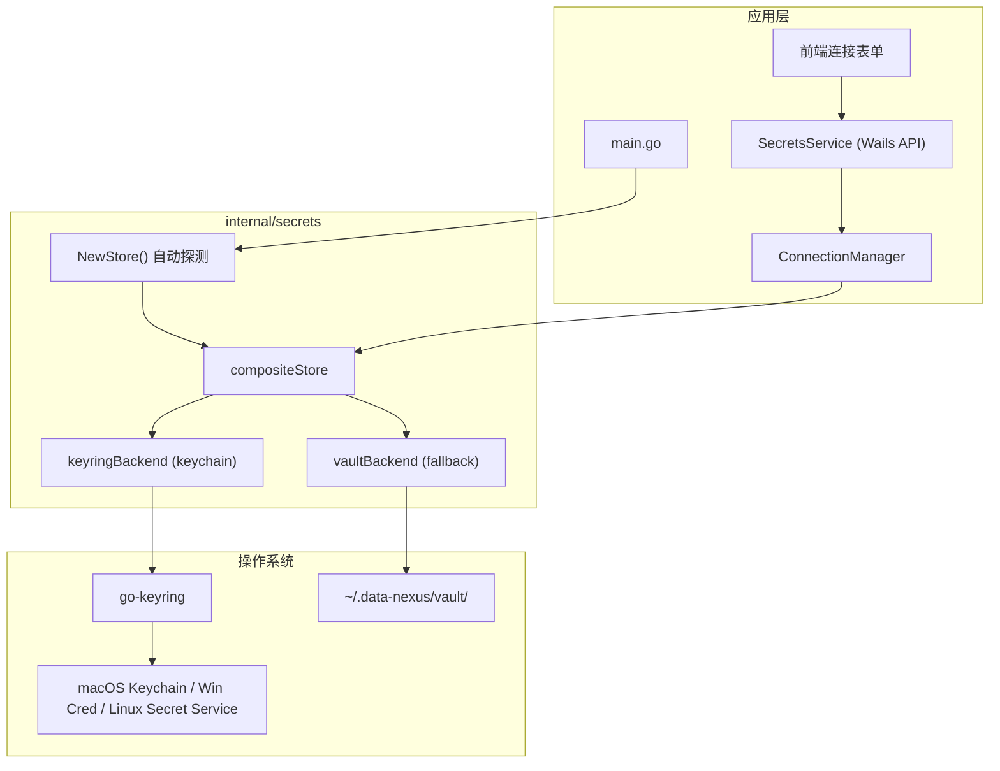
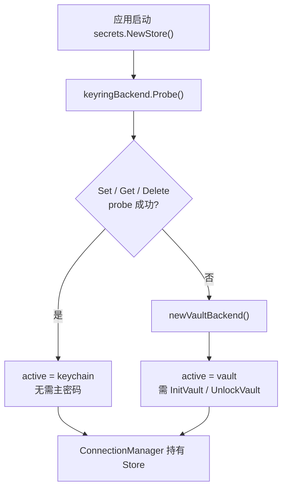
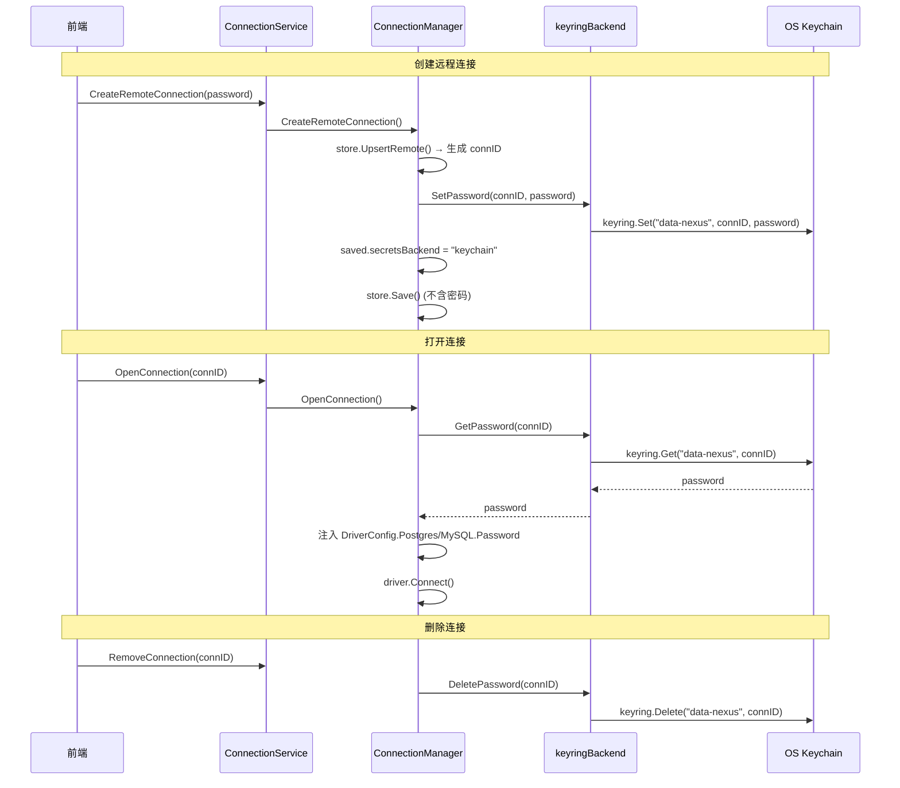
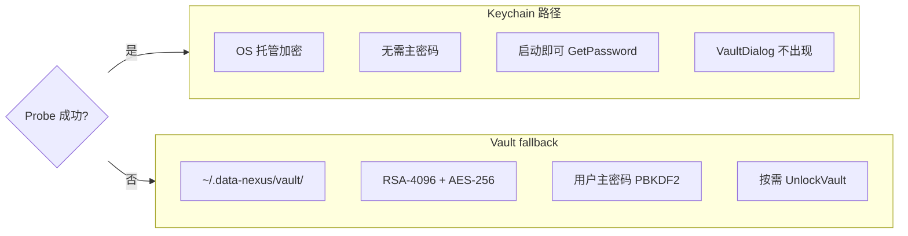

# Data Nexus — OS Keychain 密码存储设计

> 版本: v1.0 · 最后更新: 2026-06-07

本文档描述远程连接密码在 **OS Keychain** 路径下的实现。Vault fallback 见 [SECRETS.md](./SECRETS.md) §4。

---

## 1. 设计目标

- 远程连接（PostgreSQL / MySQL）密码**绝不**写入 `catalog.db`
- 优先委托操作系统密钥环加密存储，用户**无需**设置主密码
- Keychain 不可用时自动 fallback 到本地 Vault（见 [SECRETS.md](./SECRETS.md)）
- 通过统一 `Store` 接口屏蔽底层差异，`ConnectionManager` 无感知

---

## 2. 总体架构

项目不直接调用 macOS Security.framework，而是通过 [`zalando/go-keyring`](https://github.com/zalando/go-keyring) 做跨平台抽象：

| 平台 | 底层实现 |
|------|----------|
| macOS | Keychain |
| Windows | Credential Manager |
| Linux | Secret Service (DBus) |



### 2.1 代码位置

| 文件 | 职责 |
|------|------|
| `internal/secrets/store.go` | `Store` 接口、`NewStore()` 探测与 `compositeStore` |
| `internal/secrets/keyring.go` | `keyringBackend`：Probe + Set/Get/Delete |
| `internal/secrets/vault.go` | Vault fallback（Probe 失败时启用） |
| `internal/service/connection_manager.go` | 创建/打开/删除连接时调用 Store |
| `internal/wails/secrets.go` | 暴露 `GetSecretsBackend()` 等 Wails API |

---

## 3. 启动时 Backend 选择（Probe）

应用启动时 `main.go` 调用 `secrets.NewStore(config.VaultDir())`，**自动探测**当前环境是否可用 OS Keychain：

```
main.go
  └── secrets.NewStore()
        ├── keyringBackend.Probe() 成功 → active = "keychain"
        └── Probe 失败            → active = "vault" (fallback)
```



### 3.1 Probe 流程

Probe 写入测试条目 → 读回校验 → 删除测试条目：

| 步骤 | 操作 | 常量 |
|------|------|------|
| 1 | `keyring.Set(service, account, value)` | service=`data-nexus`, account=`__data_nexus_probe__`, value=`probe` |
| 2 | `keyring.Get(service, account)` | 校验返回值 == `probe` |
| 3 | `keyring.Delete(service, account)` | 清理探测条目 |

任一步失败 → 判定 Keychain 不可用，fallback 到 Vault。

### 3.2 决策规则

- 用户**不能**手动选择 backend（v1.0 自动决策）
- `SavedConnection.secretsBackend` 记录创建/更新时使用的 backend，便于 UI 提示
- 典型 Probe 失败场景：Linux 无 Secret Service、无头容器、CI 环境

---

## 4. Keychain 存储模型

### 4.1 命名规则

| 字段 | 值 | 说明 |
|------|-----|------|
| **Service** | `data-nexus` | 应用标识，所有条目共用 |
| **Account** | 连接 `id`（ULID） | 每条远程连接一个条目 |
| **Secret** | 数据库密码 | 由 OS 加密保护 |

### 4.2 CRUD 操作

| Store 方法 | go-keyring 调用 | 行为 |
|------------|-----------------|------|
| `SetPassword(connID, pw)` | `keyring.Set("data-nexus", connID, pw)` | 创建或覆盖 |
| `GetPassword(connID)` | `keyring.Get("data-nexus", connID)` | `ErrNotFound` → 返回空字符串（非错误） |
| `DeletePassword(connID)` | `keyring.Delete("data-nexus", connID)` | `ErrNotFound` → 忽略 |

### 4.3 Vault 接口的 no-op 行为

Keychain 模式下，Vault 相关方法均为空操作：

| 方法 | 返回值 / 行为 |
|------|---------------|
| `VaultInitialized()` | 恒 `true` |
| `VaultUnlocked()` | 恒 `true` |
| `InitVault()` / `UnlockVault()` / `LockVault()` / `ChangeVaultPassword()` | 直接返回 `nil` |

因此 Keychain 用户**不会**触发 `VaultDialog` 主密码弹窗。

---

## 5. 远程连接密码生命周期

密码**绝不**写入 `catalog.db`，只通过 `ConnectionManager` 与 Secrets Store 交互。



### 5.1 与 ConnectionManager 集成

| 操作 | Secrets 行为 | Keychain 特殊点 |
|------|-------------|----------------|
| `CreateRemoteConnection` | `SetPassword(connID, pw)` | 记录 `secretsBackend: "keychain"` |
| `OpenConnection`（远程） | `GetPassword(connID)` → 注入 `DriverConfig` | 无需解锁 |
| `RemoveConnection`（远程） | `DeletePassword(connID)` | — |
| `UpdatePostgres/MySQLSettings`（含新密码） | `SetPassword` | — |
| `TestConnection` | **不使用** Store | 请求内 `password` 直接 Connect+Ping |
| `RestoreConnectionsOnStartup` | `GetPassword` | 可直接恢复，无 vault 锁定问题 |

### 5.2 启动恢复

`RestoreConnectionsOnStartup` 仅在 **vault backend 且未解锁** 时跳过远程连接：

```
for each openConnectionID:
  if remote && backend==vault && !VaultUnlocked():
    skip  // 仅 vault 路径
  else:
    OpenConnection(id)  // keychain 路径始终可恢复
```

---

## 6. Keychain vs Vault 对比



| 维度 | Keychain | Vault (fallback) |
|------|----------|------------------|
| 触发条件 | Probe 成功 | Linux 无 Secret Service、容器环境等 |
| 用户交互 | 无 | Init / Unlock 主密码对话框 |
| 存储位置 | OS 密钥环 | `vault.json` + `rsa_private.enc` |
| 启动恢复远程连接 | 自动 | vault 锁定则跳过 |
| `IsVaultRequiredForRemote()` | `false` | `true` |

---

## 7. 前端感知

前端通过 Wails `SecretsService` 查询当前 backend：

| API | Keychain 返回值 |
|-----|----------------|
| `GetSecretsBackend()` | `"keychain"` |
| `VaultInitialized()` | `true` |
| `VaultUnlocked()` | `true` |
| `IsVaultRequiredForRemote()` | `false` |

Keychain 用户创建/打开远程连接时**不会**触发 `VaultDialog`。仅 vault backend 遇到 `SECRETS_VAULT_LOCKED` / `SECRETS_VAULT_NOT_INITIALIZED` 时弹窗解锁后重试原操作。

---

## 8. 安全边界（v1.0）

- 密码不进 `catalog.db`、不进日志、不进 Wails 持久化绑定缓存
- 不支持 Touch ID / 生物识别解锁
- 不跨设备同步（换机需重新输入连接密码）
- `TestConnection` 的密码仅在请求内存中短暂存在，不持久化
- v1.0 不支持证书/IAM 等替代认证

---

## 9. 验收要点

- [ ] macOS / Windows / Linux（有 Secret Service）环境下 Probe 成功，backend 为 `keychain`
- [ ] 创建远程连接后，密码不出现在 `catalog.db`
- [ ] 重启应用后可打开已保存的远程连接（无需主密码）
- [ ] 删除连接后，Keychain 中对应条目被清除
- [ ] `TestConnection` 不读写 Keychain
- [ ] Probe 失败环境 fallback 到 Vault，行为符合 [SECRETS.md](./SECRETS.md) §4

---

交叉引用：[SECRETS.md](./SECRETS.md) · [DATA_MODEL.md](./DATA_MODEL.md) · [API.md](./API.md) · [CONNECTION_UX.md](./CONNECTION_UX.md)
