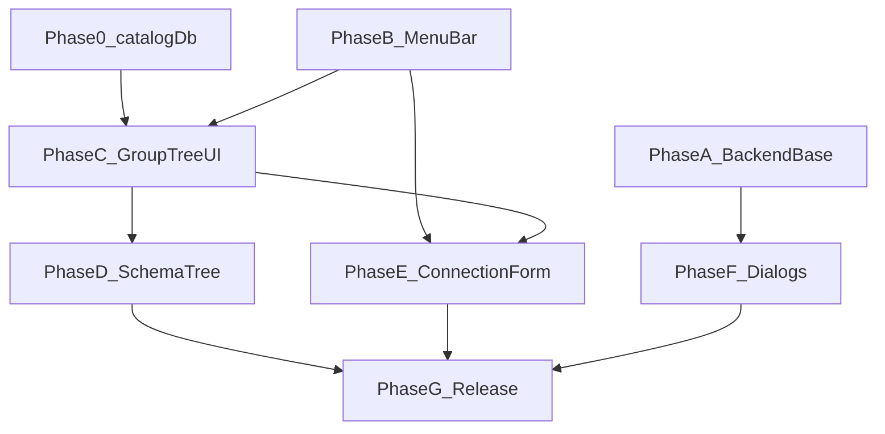

# v0.5 实施方案

> **主清单:** [phase-v0.5.md](../phase-v0.5.md) · **设计:** [DESIGN.md](./DESIGN.md) · **验收:** [manual-checklist.md](./manual-checklist.md)

---

## 1. 背景与现状

v0.4 已完成 PostgreSQL / MySQL 远程连接。当前桌面 UI 仍沿用 MVP 布局：

| 现状 | v0.5 目标 |
|------|-----------|
| `Header.tsx` 仅标题 + 设置按钮 | 顶栏：**Win/Linux** `AppMenuBar`；**macOS** 系统菜单 + 应用内状态行 |
| `ConnectionTree` 顶部：新建连接、readOnly/wal、启动恢复 | 左侧纯连接列表；全局操作迁入 MenuBar / Dialog |
| `NewConnectionDialog` 顶部 Tab + 扁平远程表单 | 宽 Dialog + 侧栏方言 + 常规/安全/高级分区；方言专属配置 |
| `RemoteConnectionForm` 与编辑 Dialog 分离 | 统一 `ConnectionForm`；MySQL charset/引擎、PG SSL/编码 |
| `connections.json` 扁平列表 | **`catalog.db`** + 嵌套 **Group**（**不迁移** json） |
| 连接 item 行内 Open/Close/Rename/Edit/Delete 按钮 | 右键 ContextMenu + 双击打开；重命名并入 **编辑连接** |
| Go `ApplicationMenu()` 含 File/View/Help 子菜单 | **macOS：** 系统菜单 File/View/Help；**Win/Linux：** 仅 App/Edit/Window + 应用内 MenuBar |
| 无跨连接 SQL 历史 UI | `SqlExecutionHistoryDialog` + `ListAllSqlExecutions` |
| 原生 `ShowAbout` | 前端 `AboutDialog`（i18n） |

**代码锚点（实施前）：**

- `frontend/src/app/AppShell.tsx` — 布局根；Dialog 状态需提升至此
- `frontend/src/components/Header.tsx` — 待重构为薄包装或移除
- `frontend/src/features/connection/ConnectionTree.tsx` — 侧边栏控件与行内按钮
- `app.go` → `ApplicationMenu()` — 原生菜单定义
- `internal/executionlog/store.go` — 尚无 `ListAllExecutions`
- `internal/service/sql_execution_service.go` — 尚无 `ListAllSqlExecutions`

- `internal/service/connection_store.go` — JSON → **catalog.db**
- `internal/catalog/` — **新增**（见 CONNECTION_GROUPS_AND_STORAGE.md）

---

## 2. 实施阶段

### Phase 0 — catalog.db 与 Group（Day 1–3）

**目标:** SQLite 持久化连接 + 分组；**无** json 迁移。详见 [CONNECTION_GROUPS_AND_STORAGE.md](./CONNECTION_GROUPS_AND_STORAGE.md)。

| # | 任务 | 文件 | 详情 |
|---|------|------|------|
| G1 | Catalog schema + migrate | `internal/catalog/sqlite/` | connections, connection_groups, group_members, app_connection_state |
| G2 | 顶层 Group「我的连接」 | `parent_id NULL` | 与游离连接第一层同级 |
| G3 | **free_connections** + **sidebar_root_items** | schema | 游离连接与根层混排 |
| G4 | Connection CRUD 迁 SQLite | 替代 `connection_store.go` JSON | config_json 列 |
| G5 | ConnectionGroupService | `connection_group_service.go` | GetSidebarTree, MoveGroup, ReorderSidebarRoot, DeleteGroup(req) |
| G6 | Wails 绑定 | `internal/wails/connection_group.go` | |
| G7 | main.go  wiring | 使用 CatalogStore | |
| G8 | 测试 | store + 首次初始化 + 嵌套 Group | |

### Phase A — 后端基础（Day 2–3）

**目标:** 全局 SQL 历史 API 就绪；Go 原生菜单精简。

| # | 任务 | 文件 | 详情 |
|---|------|------|------|
| A1 | Store 接口扩展 | `internal/executionlog/store.go` | 新增 `ListAllExecutions(ctx, limit)` |
| A2 | SQLite 实现 | `internal/executionlog/sqlite/store.go` | `ORDER BY executed_at DESC`，跨 connection_id |
| A3 | Store 单元测试 | `internal/executionlog/sqlite/store_test.go` | 多连接插入 → 全局列表顺序与 limit |
| A4 | Service 层 | `internal/service/sql_execution_service.go` | `ListAllSqlExecutions(ctx, limit)`；nil store 返回空列表；limit 默认 50、上限 200 |
| A5 | Service 测试 | `internal/service/sql_execution_service_test.go` | 覆盖默认 limit、上限截断 |
| A6 | Wails 绑定 | `internal/wails/sql_execution.go` | `ListAllSqlExecutions(limit int)` |
| A7 | Wails 测试 | `internal/wails/services_test.go` | 绑定 smoke test |
| A8 | 重新生成 TS 绑定 | `wails generate` / `make generate` | 更新 `wailsjs/go/wails/SqlExecutionService` |
| A9 | 原生菜单（平台分治） | `app_menu.go` / `app_menu_darwin.go` | macOS：File（含新建分组）/View/Help + EventsEmit；Win/Linux：App/Edit/Window |
| A10 | 文件拖放事件化 | `app.go` `handleFileDrop` | emit `app:file-drop`；前端 attach / 新建连接分流 |
| A11 | macOS 应用内 Menubar 隐藏 | `AppMenuBar.tsx` + `lib/platform.ts` | `useIsMacOS()`；HIG 合规 |

**完成标准:** `make test` 通过；Wails 绑定可调用 `ListAllSqlExecutions`。

详见 [BACKEND.md](./BACKEND.md)。

---

### Phase B — 前端基元与 MenuBar（Day 2–3）

**目标:** Radix 菜单基元、顶栏 MenuBar、AppShell 统一 Dialog 状态。

| # | 任务 | 文件 | 详情 |
|---|------|------|------|
| B1 | 安装依赖 | `frontend/package.json` | `@radix-ui/react-menubar`、`@radix-ui/react-context-menu` |
| B2 | Menubar 基元 | `frontend/src/components/ui/Menubar.tsx` | shadcn 风格 wrapper |
| B3 | ContextMenu 基元 | `frontend/src/components/ui/ContextMenu.tsx` | shadcn 风格 wrapper |
| B4 | AppMenuBar | `frontend/src/components/AppMenuBar.tsx` | Win/Linux：文件/视图/帮助（文件含**新建分组**）；macOS：仅状态行 |
| B5 | 重构 Header | `frontend/src/components/Header.tsx` | macOS `h-9`；Win/Linux `h-12` |
| B6 | AppShell 原生菜单事件 | `AppShell.tsx` | 监听 `app:new-connection`、`app:new-group`、`app:open-sqlite` 等 |
| B6b | AppShell Dialog 状态 | `frontend/src/app/AppShell.tsx` | 集中管理：`newConnectionOpen`、`settingsOpen`、`sqlHistoryOpen`、`aboutOpen` |
| B7 | 快捷键（v0.5 固定值） | `AppShell.tsx` | `Cmd/Ctrl+N/O/W/,` 监听；Quit 仍走 macOS App 菜单 |
| B8 | i18n 菜单键 | `frontend/src/locales/*.json` | `menu.file.*`、`menu.view.*`、`menu.help.*` |

**MenuBar 行为矩阵:**

| 菜单项 | 动作 | 快捷键 |
|--------|------|--------|
| 新建连接… | 打开 `NewConnectionDialog` | N |
| 打开 SQLite 文件… | 文件对话框 + `openFromFile`（快速保存并 open） | O |
| 关闭当前连接 | `CloseConnection(activeConnectionId)` | W |
| 新建分组… | `CreateGroup('', name)` 顶层 Group | — |
| 退出 | `runtime.Quit`（或通过 Wails API） | Q（macOS App 菜单） |
| SQL 执行历史… | 打开 `SqlExecutionHistoryDialog` | — |
| 设置… | 打开 `SettingsDialog` | `,` |
| 关于 Data Nexus | 打开 `AboutDialog` | — |

**向导模式:** `exportSession` / `importSession` 期间 MenuBar 仍可见；File 部分项 disabled；右侧显示向导标题（沿用现有 `wizardTitle`）。

详见 [FRONTEND.md § AppMenuBar](./FRONTEND.md#1-appmenubar)。

---

### Phase C — Group 树 UI + 连接列表（Day 3–5）

**目标:** 侧边栏渲染 Group 嵌套树；连接节点 + ContextMenu + **拖拽**。详见 CONNECTION_GROUPS_AND_STORAGE §3.6、§6。

| # | 任务 | 详情 |
|---|------|------|
| C1 | `ConnectionGroupNode.tsx` | 📁；**inline 重命名**（F2/Enter）；单击选中 + 拖放标记；右键 **新建/重命名/删除**；**DeleteGroupDialog** |
| C1b | `ConnectionTreeItem.tsx` | 右键 **打开/关闭/重命名/编辑/删除**（SQLite open 时「附加数据库…」）；**inline 重命名**（open/closed）；draggable |
| C2 | `ConnectionTree.tsx` | `GetSidebarTree` 驱动；**F2/Enter** 重命名；`selectedGroupId` / `sidebarFocus` |
| C3 | 新建连接入 Group | `selectedGroupId`：NewConnectionDialog / Cmd+O / AppShell / 拖 `.db` 到 Group |
| C4 | `SidebarDndContext` + hooks | Group 改父级；连接移 Group/游离；**`@dnd-kit/sortable` 同级排序** |
| C5 | 后端 API | `MoveGroup`, `ReorderGroupMembers`, `ReorderSidebarRoot` |
| C6 | 测试 | 嵌套、DnD、首次启动初始化后树正确 |

---

### Phase D — Schema 层级树 + SQLite Attach（Day 5–7）

**目标:** 连接下 database/schema 层级树；SQLite Attach/Detach UI。详见 [CONNECTION_TREE.md](./CONNECTION_TREE.md)。

| # | 任务 | 文件 | 详情 |
|---|------|------|------|
| S1 | 移除侧边栏顶部控件 | `ConnectionTree.tsx` | 删除新建按钮、readOnly/wal、`RestoreOnStartupToggle` |
| S2 | 移除底部 openCount | `ConnectionTree.tsx` | 计数改由 MenuBar 右侧展示 |
| S3 | 双击/单击/右键 | `ConnectionTreeItem` | 同 DESIGN §4.3 |
| S4 | **ListNamespaces** | Driver + `SchemaService` + Wails | 扩展 `Driver` interface；SQLite: main+attach；MySQL: SHOW DATABASES；PG: pg_database |
| S5 | **ListSchemas** | PG Driver + Service | `information_schema.schemata`，按 database |
| S6 | **ListTables 扩展** | `ListTablesOptions{database, schema}` | 按 namespace 过滤；向后兼容 |
| S7 | ConnectionSchemaTree | `features/connection/tree/` | NamespaceNode、SchemaNode、懒加载 |
| S8 | browseContext | `workspaceStore.ts` | namespace + schema；驱动右侧 Tab |
| S9 | 移除 RemoteNamespaceSwitch / **SchemaSubtree** | — | **已删除** |
| S10 | SettingsDialog 迁入恢复 | `SettingsDialog.tsx` | |
| S11 | 测试 | 各 dialect 树、懒加载、tableKey |
| S12 | `AttachDatabaseDialog` + SQLite L0「附加数据库…」 | `AttachDatabaseDialog.tsx` + `ConnectionTreeItem` | 见 CONNECTION_TREE §3.6 |
| S12b | 移除 v0.4 Attach 按钮与 `window.prompt` | `ConnectionSchemaTree` | 已合并 |
| S12c | **拖拽 `.db` 到已 open SQLite** | `useSidebarFileDrop.ts` | `app:file-drop` + `data-sqlite-drop-target` |
| S12d | attach L1 右键 Detach + Finder | `ConnectionSchemaTree` + `RevealFileInExplorer` | 已实现 |
| S12e | **DnD 同级排序** | `SidebarDndContext` + `sidebarOrder.ts` | `ReorderSidebarRoot` / `ReorderGroupMembers` |
| S12f | **`rootItems` / `memberItems`** | `groups.go` + TS types | 根级/组内交错顺序 |

---

### Phase E — 新建/编辑连接表单重构（Day 6–8）

**目标:** 浮动 Dialog UI 重构；方言感知配置；新建/编辑共用组件。详见 [CONNECTION_FORM.md](./CONNECTION_FORM.md)。

> Phase E 可与 Phase D 在 Day 6–7 **部分并行**（不同开发者）；Day 范围以 [README.md](./README.md) 发布节奏为准。

| # | 任务 | 文件 | 详情 |
|---|------|------|------|
| F1 | 模型扩展 | `internal/model/connection.go` | MySQL: `charset`, `collation`, `defaultStorageEngine`；PG: `clientEncoding` |
| F2 | SettingsUpdate 扩展 | `connection.go`, `connection_store.go` | 读写新字段 |
| F3 | MySQL DSN | `internal/driver/mysql/mysql.go` | charset/collation 来自配置；Connect 后 SET storage engine |
| F4 | PostgreSQL DSN | `internal/driver/postgres/postgres.go` | `client_encoding` query param |
| F5 | 模型/Driver 测试 | `*_test.go` | DSN、默认值、持久化 |
| F6 | TS 类型 | `frontend/src/lib/types/index.ts` | 对齐 Go 模型 |
| F7 | ConnectionForm 组件族 | `features/connection/ConnectionForm/` | 侧栏 + General/Security/Advanced sections |
| F8 | NewConnectionDialog | 重构为 create 壳 | 宽 Dialog，底部测试+保存 |
| F9 | EditConnectionDialog | 复用 ConnectionForm | mode=edit；SQLite 路径只读；**拒绝 open 连接** |
| F9b | 后端 | `UpdateConnection*` | 连接 open → `CONNECTION_OPEN`；password 留空跳过更新 |
| F10 | 废弃 RemoteConnectionForm | 合并至 ConnectionForm | |
| F11 | charset→collation 联动 | `MySQLFields.tsx` | 预设选项表 |
| F12 | i18n | `connectionForm.*` | |
| F13 | 测试 | `ConnectionForm.test.tsx` 等 | 三方言、联动、编辑密码留空 |

---

### Phase F — 新 Dialog（Day 8–9）

**目标:** SQL 执行历史、关于对话框。

| # | 任务 | 文件 | 详情 |
|---|------|------|------|
| H1 | API 封装 | `frontend/src/lib/api/queryHistory.ts` | `listAllExecutions(limit?)` |
| H2 | SqlExecutionHistoryDialog | `frontend/src/features/sql-history/SqlExecutionHistoryDialog.tsx` | 表格：时间、连接名、SQL 摘要、类型、耗时/影响行 |
| H3 | 点击行跳转 | `SqlExecutionHistoryDialog` | 关闭 Dialog → 切换 `activeConnectionId` → SQL Tab → 填充编辑器 |
| H4 | AboutDialog | `frontend/src/components/AboutDialog.tsx` | `AppService.GetVersion` + `AppService.GetPlatform()` |
| H5 | i18n | `locales/*.json` | `sqlHistory.*`、`about.*`、`settings.restoreOnStartup` |
| H6 | 测试 | `SqlExecutionHistoryDialog.test.tsx` | mock API、点击跳转 |
| H7 | 测试 | `AboutDialog.test.tsx` | 版本与平台展示 |

详见 [DESIGN.md § Dialog](./DESIGN.md#5-dialog) 与 [FRONTEND.md § Dialog](./FRONTEND.md#3-dialog-组件)。

---

### Phase G — 收尾与发布（Day 9–10）

| # | 任务 | 说明 |
|---|------|------|
| R1 | 全量测试 | `make test`、`cd frontend && npm test` |
| R2 | 手动验收 | [manual-checklist.md](./manual-checklist.md) |
| R3 | 回归 v0.4 | SQLite + PG/MySQL 连接、导出/导入向导 |
| R4 | 更新 phase-v0.5.md checklist | 全部勾选 |
| R5 | tag | `v0.5.0` |

---

## 3. 文件变更总览

### 新增

```
app_menu.go
app_menu_darwin.go
frontend/src/lib/platform.ts
frontend/src/features/connection/dnd/sidebarOrder.ts
frontend/src/features/connection/dnd/useSidebarFileDrop.ts
frontend/src/components/ui/Menubar.tsx
frontend/src/components/ui/ContextMenu.tsx
frontend/src/components/AppMenuBar.tsx
frontend/src/components/AboutDialog.tsx
frontend/src/features/sql-history/SqlExecutionHistoryDialog.tsx
frontend/src/features/sql-history/SqlExecutionHistoryDialog.test.tsx
frontend/src/features/connection/DeleteGroupDialog.tsx
frontend/src/features/connection/DeleteGroupDialog.test.tsx
frontend/src/features/connection/AttachDatabaseDialog.tsx
frontend/src/features/connection/AttachDatabaseDialog.test.tsx
frontend/src/features/connection/tree/
  ConnectionSchemaTree.tsx
  NamespaceNode.tsx
  SchemaNode.tsx
  TreeNodeRow.tsx
  useConnectionTree.ts
frontend/src/features/connection/ConnectionForm/
  ConnectionForm.tsx
  FormField.tsx
  connectionFormValidation.ts
  DialectSidebar.tsx
  sections/GeneralSection.tsx
  sections/SecuritySection.tsx
  sections/AdvancedSection.tsx
  fields/SQLiteFields.tsx
  fields/PostgresFields.tsx
  fields/MySQLFields.tsx
  connectionFormDefaults.ts
  ConnectionForm.test.tsx
frontend/src/features/connection/placeConnectionInGroup.ts
frontend/src/features/connection/sidebarRenameHandlers.ts
frontend/src/features/connection/ConnectionGroupNode.test.tsx
frontend/src/features/connection/ConnectionTreeItem.test.tsx
frontend/src/features/connection/dnd/useSidebarFileDrop.test.tsx
internal/catalog/
  sqlite/store.go
  sqlite/groups.go
  sqlite/connections.go
  sqlite/store_test.go
internal/service/connection_group_service.go
internal/wails/connection_group.go
internal/driver/mysql/namespaces.go
internal/driver/postgres/namespaces.go
```

### 修改

```
frontend/package.json
frontend/src/app/AppShell.tsx
frontend/src/components/Header.tsx
frontend/src/features/connection/ConnectionTree.tsx
frontend/src/stores/workspaceStore.ts
frontend/src/features/connection/NewConnectionDialog.tsx
frontend/src/features/connection/NewConnectionDialog.test.tsx
frontend/src/features/connection/EditConnectionDialog.tsx
frontend/src/features/connection/EditConnectionDialog.test.tsx
internal/model/connection_group.go   # RootItems, MemberItems
internal/catalog/sqlite/groups.go
app.go
```

### 删除

```
frontend/src/features/schema/SchemaSubtree.tsx
frontend/src/features/schema/SchemaSubtree.test.tsx
```

### 可选删除 / 精简（已完成）

```
app.go — handleOpenDatabase、handleCloseConnection（已移除）
RemoteConnectionForm.tsx — 已合并至 ConnectionForm 并删除
```

---

## 4. 依赖关系



- **Phase 0** 是 Phase C 的前置（`GetSidebarTree` 数据源）
- **A 与 B 可并行**（不同开发者）
- **C 依赖 B**（MenuBar 提供新建连接入口）
- **D 依赖 C**（侧边栏控件已迁出；Schema 树挂载于连接节点）
- **E 依赖 C**；可与 D 在 Day 6–7 部分并行
- **F 依赖 A**（全局历史 API）

---

## 5. 风险与缓解

| 风险 | 缓解 |
|------|------|
| macOS 双菜单（原生 + 应用内）重复 | macOS **隐藏应用内 Menubar**；菜单仅系统栏 |
| WebView 快捷键与 Monaco 冲突 | v0.5 固定快捷键；v0.5.1 统一 ShortcutRegistry |
| 连接树移除按钮后新用户不知何操作 | 空列表提示「文件 → 新建连接」；无分组时「文件 → 新建分组」或空白右键 |
| `ListAllExecutions` 大表性能 | limit 默认 50、上限 200；与 per-connection API 一致 |
| 窗口级 drop 与连接节点 drop 冲突 | Go emit `app:file-drop`；前端 `useSidebarFileDrop` 分流 |
| 删除全部分组后无法新建 Group | **文件 → 新建分组…** 或根层空白右键 |

---

## 6. 完成标准

- [x] [phase-v0.5.md](../phase-v0.5.md) §3 功能清单全部勾选
- [x] [manual-checklist.md](./manual-checklist.md) 代码可验证项已勾选（需实机项见清单备注）
- [x] `make test` + 前端测试通过
- [x] tag **`v0.5.0`**（GitHub Release 自动打 tag，本地不创建）

---

## 7. 下一版本衔接

[v0.5.1](../phase-v0.5.1.md) 将在 v0.5 基础上：

- 原生菜单文案随 `app:language` 动态更新
- 快捷键可配置 + `config.yaml` 持久化
- MenuBar / 系统菜单显示动态快捷键文案

v0.5 实施时请 **预留** `AppShell` 快捷键 hook 与 `SettingsDialog` 扩展位，但 **不提前实现** v0.5.1 功能。
